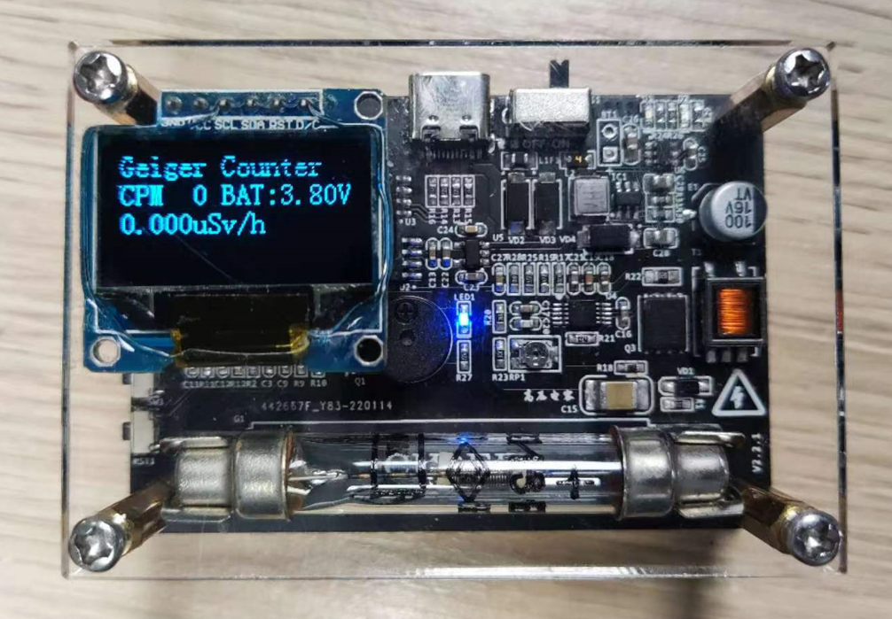

# 盖革计数器

盖革管型号SI3BG，这个型号的盖革管价格便宜，量程比较大，灵敏度比较低，所以测量结果仅供参考。

## 1. 工程说明

### 1.1 参考设计

盖革管的测量电路设计参考[https://oshwhub.com/zhaokbk/si3bg_copy_copy](https://oshwhub.com/zhaokbk/si3bg_copy_copy)
盖革管电源驱动部分参考[https://oshwhub.com/zhaokbk/lm3481-gao-xiao-bian-ya-qi-hui-guang-guan-sheng-ya-mu-kuai](https://oshwhub.com/zhaokbk/lm3481-gao-xiao-bian-ya-qi-hui-guang-guan-sheng-ya-mu-kuai)

### 1.2 注意事项

1. OLED屏安装在左上角，屏幕的PCB会和铜柱发生干涉，所以只能将屏幕PCB锯掉一点，因为屏幕已经粘在亚克力板上，所以没有调整位置，介意的可以自行将屏幕右移。
2. 为什么加了一个5V的升压电路给盖革管驱动供电？去掉行不行？因为经过实测，要升压至400V，盖革管驱动部分的输入电压需要在3.8V以上，否则输出无法达到400V，且电压较高驱动电路部分的效率也较高，电压降低时功耗会急剧增大，影响续航。
3. 升压部分MOS管型号怎么选？
   * 选择导通阻抗低的，可以减小功耗。
   * 线圈副边升压至400V，匝数比1：10，所以原边MOS管的反向耐压值应该大于40V
4. 因为要提高盖革管驱动部分的效率，所以添加了一个5V的升压电路，系统不够简介，可以更换一个带5V输出的锂电池充电芯片，简化电路方案。
5. SWDIO口的接口型号为SH1.0-4P
